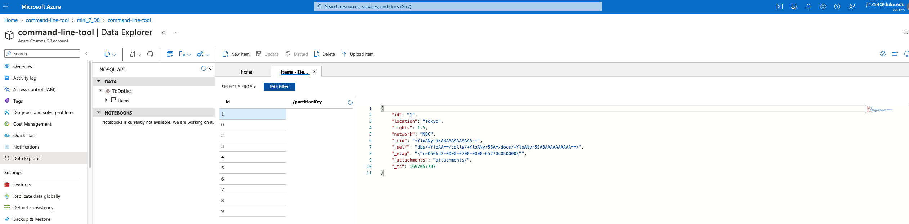
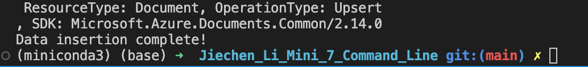
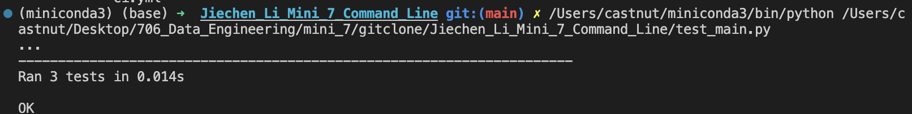

[](https://github.com/nogibjj/Jiechen_Li_Mini_7_Command_Line/actions/workflows/ci.yml)

## Jiechen_Li_Mini_7_Command_Line

### Purpose

* Package a Python script with setuptools.
* Include a user guide on how to install and use the tool.
* Include communication with an external database NoSQL using Azure CosmosDB.

### Directory Structure

```

Jiechen_Li_Mini_7_Command_Line/
  ├──.devcontainer/
      ├──.Dockerfile
      └──devcontainer.jason
  ├──.github/
      └──workflows/
        └──ci.yml
  ├──.DS_Store
  ├──.gitignore
  ├──LICENSE
  ├──Makefile
  ├──cosmosdb_show.png
  ├──data_insertion.png
  ├──test_result.png
  ├──OlympicTV.csv
  ├──README.md
  ├──azure_addcsv.py
  ├──setup.py
  └──test_addcsv.py
```

### User Guide

**Setting up the Repository on GitHub**:

1. Create a new repository on GitHub.
2. Clone the repository to local IDE.

**Creating the Python Tool**:

1. Create a file called ``azure_addcsv.py``. This will be the main entry point for our command-line tool.
2. Inside ``azure_addcsv.py``, impoert ``OlympicTV.csv`` and write the Python code to communicate with CosmosDB. This code will use the Azure SDK to interact with Azure services.

**Packaging the Tool**:

1. In the root directory of the repository, create a file called ``setup.py``.
2. Add the necessary configurations to setup.py for packaging.
3. Also, modify the ``requirements.txt`` file to list down all the dependencies.

**Deploying Azure CosmosDB**

1. Sign in to Azure.
2. In the Azure portal, click on "Create a resource".
3. Search for "Azure Cosmos DB" and select it.
4. Click on the "Create" button.
5. Fill in the required fields, and click "Review + Create".
6. Get the Connection String: Once your Cosmos DB account is deployed, go to the account overview.
7. Navigate to "Keys" under the "Security + networking" section. Here, you'll find your connection string which will be used to connect to the database.
8. Create a Database:
Inside your Cosmos DB account, click on "Data Explorer" from the left menu.
Click on the "New Container" button.
First, you'll be prompted to create a new database. Enter a unique name for your database.
9. Create a Container:
After specifying the database name, you'll be prompted to create a container.
Enter a unique name for your container.
Choose a partition key. This is essential for distributing data and workload across multiple partitions. For simplicity, you can use ``/id`` as the partition key for this guide.
10. Using tools:

*Install the Tool*:

```
pip install azure-cosmos
```

*Add an item*:

```
azure_addcsv.py add --database <DATABASE_NAME> --container <CONTAINER_NAME> --item <ITEM_JSON>
```

*Fetch an item*:

```
azure_addcsv.py fetch --database <DATABASE_NAME> --container <CONTAINER_NAME> --id <ITEM_ID>
```

### Results

**Interaction with Azure CosmosDB**:<br/>
  

**Data Insertion**: <br/>
  

**Test**: <br/>
  

### Reference

Please click <a href="https://github.com/nogibjj/Jiechen_Li_Mini_2_Pandas.git" target="_blank">here</a> to see the template of this repo.
